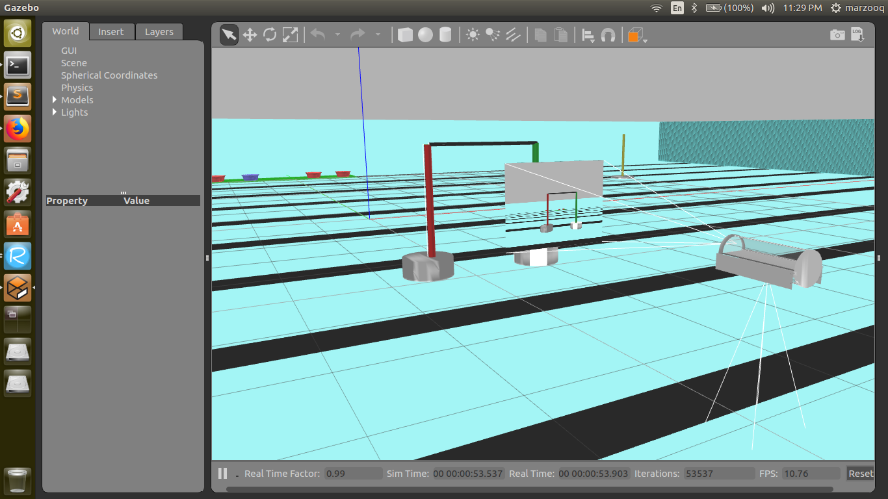

Open terminal and run:
```
git clone https://github.com/auvzhcet/AUV_SOFTWARE.git
```
*To open the simulation: First copy the model folders present in*


***
```
sea_simulation/models_sea
```
into your 
```
~/.gazebo/models/
 ```
 directory
 ***

Then open terminal and run 
 ```
 cd /home/AUV_SOFTWARE/sea_simulation
 ```
 ```
 gazebo sea_simul.world
 ```

Resources/Turoials

https://www.youtube.com/watch?v=aP4sDyrRzpU&t=561s

https://www.youtube.com/watch?v=T7X_p_KMwus


**IMPORTANT MESSAGE FOR CONTRIBUTORS:** Contributors should run `git pull` in the repo directory after cloning and then run `git push` after commiting changes in local copy of repo
**(NO EDITS ARE TO BE MADE ONLINE)**.

When resuming work on the repo after a break the contributer must
pull the repo into his/her local machine again to keep in sync
with the online repo.
